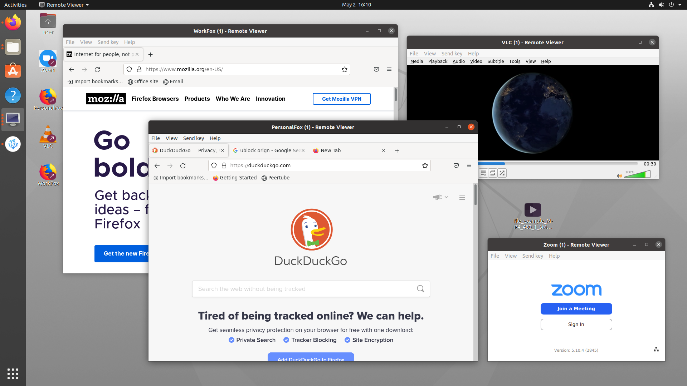

# VMPack

Run GUI linux applications in QEMU VMs for security via isolation.



Disclaimer: This project is still in experimental stages, for example clipboard isolation isn't a feature yet, so please keep in mind the limitations.

## Why?

- Security via isolation to protect against malicious/exploitable applications
- QEMU/KVM Sandboxing for protection against priv. esc. and other kernel exploits

## Features

- Multiple isolated instances of any app(s)
- GPU Acceleration via virtio-gpu with gl=on
- Drag and drop
- Window Resize
- Clipboard (need to limit permission)
- Sound and microphone (need to limit permission)
- Simple codebase. Just bash scripts and Dockerfiles (for now)
- USB Devices like Webcam

## Prerequisites
- Tested with Ubuntu and Arch based distros
- Docker installed and user added to docker group via `sudo gpasswd -a $USER docker`. Used for building images
- Dependencies for Ubuntu-based distros `sudo apt install git libguestfs-tools socat virt-manager`
- Dependencies for Arch-based distros `sudo pacman -S git guestfs-tools socat virt-manager qemu-full`
- Reboot your system or reload your session

## Get started

1. Install vmpack
```
cd ~/
git clone git@github.com:Openw3b/vmpack.git .vmpack
ln -s ~/.vmpack/vmpack ~/.local/bin/vmpack
```

2. Build and install an App [Example]
```
vmpack build firefox
vmpack install firefox WorkFox
```

> No spaces in the app name.
> The install might take some time for the first time

3. Open the app from Desktop, Applications (if you had added it) or via

```
vmpack start WorkFox
```

You should see Firefox loaded.

4. Create another firefox instance and start it

```
vmpack install firefox PersonalFox
vmpack start PersonalFox
```

You now have two instances of Firefox each running in it's own VM

## Currently supported apps

- Firefox
- VLC
- Zoom

Super easy to add more though. 
- Copy firefox folder from templates to a new folder and name it based on the app you want
- Change the Dockerfile PACKAGES, COMMAND
- Change the icon.png
- Build and install just like you did with firefox

## Conributing

- Please send pull requests for more apps, documentation and simple fixes
- A version of this using crosvm, nixpkgs and nixos is in early experimentation stage. Connect over at #openw3b:matrix.org to join the ideation, discussion

## Licence

MIT Licence
